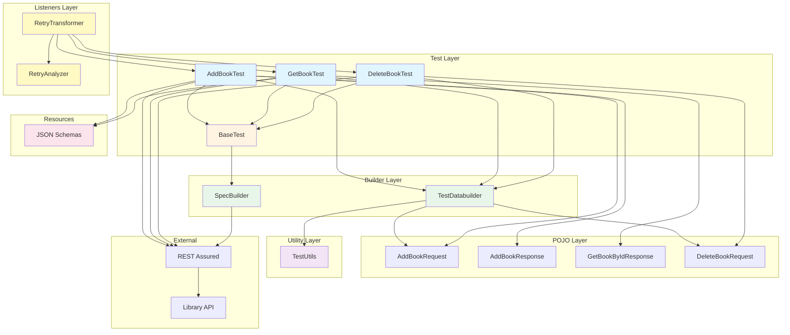
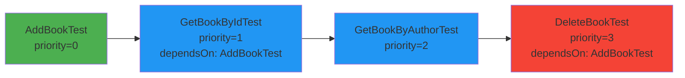
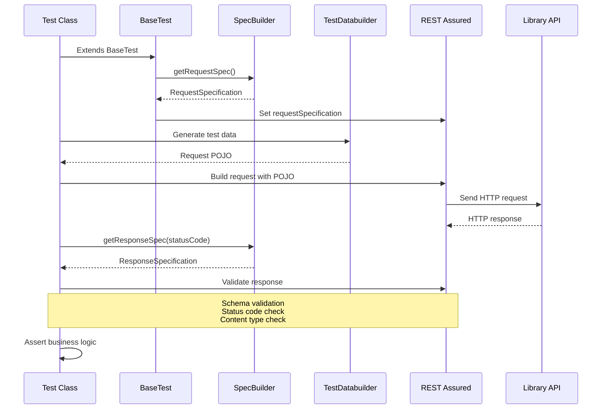
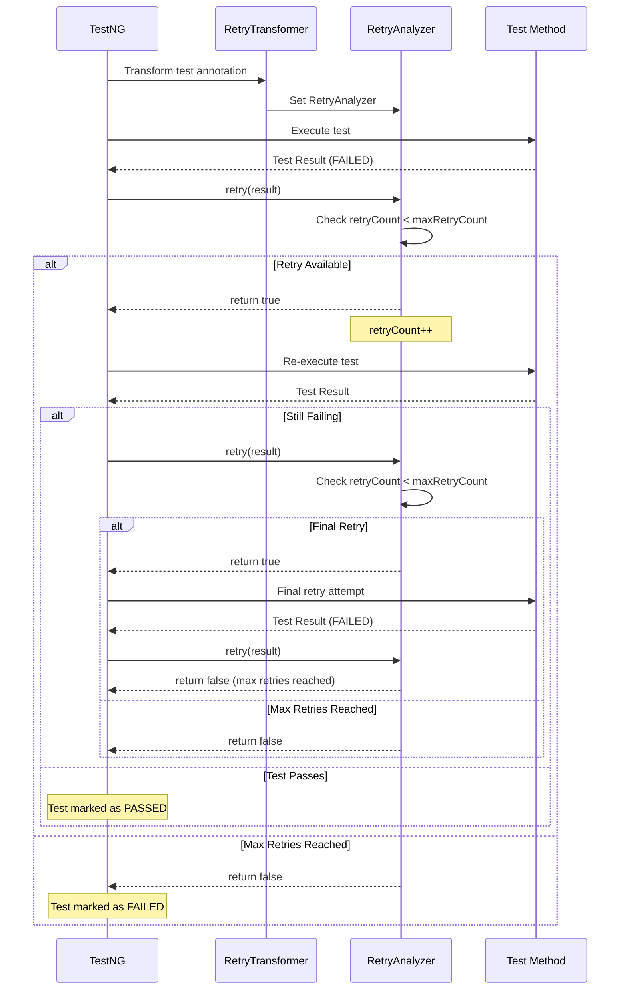

# REST Assured API Testing Framework

A comprehensive, maintainable API testing framework built with REST Assured, TestNG, and Maven for testing Library Management API endpoints.

## 📋 Table of Contents

- [Overview](#overview)
- [Framework Architecture](#framework-architecture)
- [Project Structure](#project-structure)
- [Key Components](#key-components)
- [Prerequisites](#prerequisites)
- [Running Tests](#running-tests)
- [Allure Reports](#-allure-reports)
- [CI/CD Integration](#cicd-integration)
- [Dependencies](#dependencies)
- [Test Execution Flow](#test-execution-flow)
- [Best Practices](#best-practices)

## 🎯 Overview

This framework provides a robust solution for API testing with the following features:

- **REST Assured Integration**: Powerful API testing with fluent assertions
- **POJO-based Request/Response Handling**: Type-safe data models
- **JSON Schema Validation**: Automatic response structure validation
- **Reusable Specifications**: Centralized request/response specifications
- **Test Data Builders**: Dynamic test data generation
- **Automatic Retry Mechanism**: Failed tests are automatically retried (up to 2 retries)
- **Allure Reports**: Beautiful, interactive test reports with detailed test execution history
- **CI/CD Integration**: GitHub Actions workflow for automated test execution
- **TestNG Integration**: Advanced test execution and reporting
- **Maven Build System**: Dependency management and test execution

### API Endpoints Tested

- **Add Book**: `POST /Library/Addbook.php`
- **Get Book by ID**: `GET /Library/GetBook.php?ID={bookId}`
- **Get Book by Author**: `GET /Library/GetBook.php?AuthorName={authorName}`
- **Delete Book**: `POST /Library/DeleteBook.php`

## 🏗️ Framework Architecture

The framework follows a layered architecture pattern for better maintainability and reusability.



### Architecture Layers

1. **Test Layer**: Contains all test classes that extend `BaseTest`
2. **Builder Layer**: Provides test data builders and request/response specifications
3. **POJO Layer**: Java objects representing API request/response models
4. **Utility Layer**: Helper methods for test data generation
5. **Listeners Layer**: TestNG listeners for retry mechanism and test execution hooks
6. **Resources**: JSON schema files for response validation

## 📁 Project Structure

```
RestAssuredSampleFramework/
├── src/
│   ├── main/
│   │   ├── java/
│   │   │   └── org/umangqa/library/
│   │   │       ├── builders/
│   │   │       │   └── TestDatabuilder.java      # Test data generation
│   │   │       ├── pojo/
│   │   │       │   ├── addbook/                  # Add book request/response POJOs
│   │   │       │   ├── deletebook/               # Delete book request/response POJOs
│   │   │       │   └── getbook/                  # Get book response POJOs
│   │   │       ├── listeners/
│   │   │       │   ├── RetryAnalyzer.java        # Retry logic implementation
│   │   │       │   └── RetryTransformer.java      # TestNG annotation transformer
│   │   │       ├── specs/
│   │   │       │   └── SpecBuilder.java          # Request/Response specifications
│   │   │       └── utils/
│   │   │           └── TestUtils.java            # Utility methods
│   │   └── resources/
│   │       └── schemas/                           # JSON schema validation files
│   │           ├── addBookResponse.json
│   │           └── getBookByIdResponse.json
│   └── test/
│       └── java/
│           └── org/umangqa/library/tests/
│               ├── BaseTest.java                  # Base test class with setup
│               ├── AddBookTest.java               # Add book test cases
│               ├── GetBookTest.java               # Get book test cases
│               └── DeleteBookTest.java            # Delete book test cases
├── .github/
│   └── workflows/
│       └── library-api-tests.yml                 # GitHub Actions CI/CD workflow
├── testng.xml                                     # TestNG suite configuration
├── pom.xml                                        # Maven dependencies and configuration
└── README.md                                      # This file
```

## 🔧 Key Components

### 1. BaseTest

Base class for all test classes that sets up common configuration:

```java
public abstract class BaseTest {
    @BeforeClass
    public void setup() {
        RestAssured.requestSpecification = SpecBuilder.getRequestSpec();
    }
}
```

**Purpose**: Initializes REST Assured with default request specifications before test execution.

### 2. SpecBuilder

Centralized builder for request and response specifications:

- **Request Specification**: Sets base URI, content type, and headers
- **Response Specification**: Validates status code and content type

**Features**:
- Configurable base URL via system property (`baseUrl`)
- Default base URL: `http://216.10.245.166`
- Reusable across all tests
- **Allure Integration**: Automatically captures HTTP requests and responses for Allure reports via `AllureRestAssured` filter

### 3. TestDatabuilder

Factory class for creating test data objects:

- `addBookRequestRandomPayload()`: Generates random test data
- `addBookRequestPayload()`: Creates payload with specific values
- `deleteBookRequestPayload()`: Creates delete request payload

### 4. TestUtils

Utility methods for test data generation:

- `generateRandomString()`: Generates random alphanumeric strings
- `generateRandomNumberString()`: Generates random numeric strings

### 5. POJO Classes

Type-safe Java objects for API requests and responses:

- Request POJOs: `AddBookRequest`, `DeleteBookRequest`
- Response POJOs: `AddBookResponse`, `GetBookByIdResponse`, `GetBookByAuthorResponse`

### 6. JSON Schema Validation

JSON schema files in `src/main/resources/schemas/` validate response structure:

- Ensures response matches expected schema
- Catches API contract violations early
- Provides clear error messages

### 7. Retry Mechanism

Automatic retry logic for failed tests using TestNG listeners:

#### RetryAnalyzer

Implements `IRetryAnalyzer` to control retry behavior:

```java
public class RetryAnalyzer implements IRetryAnalyzer {
    private int retryCount = 0;
    private static final int maxRetryCount = 2;
    
    @Override
    public boolean retry(ITestResult result) {
        if (retryCount < maxRetryCount) {
            retryCount++;
            return true; // Retry the test
        }
        return false; // No more retries
    }
}
```

**Features**:
- Automatically retries failed tests up to 2 times
- Logs retry attempts for debugging
- Configurable maximum retry count

#### RetryTransformer

Implements `IAnnotationTransformer` to automatically apply retry analyzer to all tests:

```java
public class RetryTransformer implements IAnnotationTransformer {
    @Override
    public void transform(ITestAnnotation annotation, ...) {
        if (annotation.getRetryAnalyzerClass() == null) {
            annotation.setRetryAnalyzer(RetryAnalyzer.class);
        }
    }
}
```

**Purpose**: 
- Automatically applies retry logic to all test methods
- No need to manually add `@Test(retryAnalyzer = RetryAnalyzer.class)` to each test
- Configured in `testng.xml` as a listener

## 📦 Prerequisites

Before running the tests, ensure you have the following installed:

- **Java**: JDK 21 or higher (Note: pom.xml uses Java 21)
- **Maven**: 3.6.0 or higher
- **Allure** (Optional but recommended): For generating interactive test reports
- **IDE**: IntelliJ IDEA, Eclipse, or VS Code (optional)

### Verify Installation

```bash
# Check Java version
java -version

# Check Maven version
mvn -version

# Check Allure installation (if installed)
allure --version
```

### Installing Allure (Optional)

Allure is recommended for generating beautiful test reports. See the [Allure Reports](#-allure-reports) section for installation instructions.

## 🚀 Running Tests

### Option 1: Using Maven

#### Run All Tests

```bash
mvn clean test
```

#### Run Specific Test Class

```bash
mvn test -Dtest=AddBookTest
```

#### Run Tests with Custom Base URL

```bash
mvn test -DbaseUrl=http://your-api-url.com
```

#### Run Tests and Generate Report

```bash
mvn clean test
# Reports are generated in: target/surefire-reports/
```

#### Generate Allure Reports

After running tests, generate and serve Allure reports:

```bash
# Generate Allure report
mvn allure:report

# Serve Allure report (opens in browser)
mvn allure:serve
```

**Note**: The `allure:serve` command will automatically open the report in your default browser. The report will be available at `http://localhost:port` (default port is usually 4040).

#### Generate Allure Report Only (without serving)

```bash
# Generate report without opening browser
mvn allure:report

# View the report later by opening:
# target/site/allure-maven-plugin/index.html
```

### Option 2: Using TestNG XML

#### Run Test Suite via Maven

```bash
mvn clean test -DsuiteXmlFile=testng.xml
```

#### Run TestNG XML from IDE

1. Right-click on `testng.xml` in your IDE
2. Select "Run" or "Run As TestNG Suite"

#### TestNG XML Configuration

The `testng.xml` file defines the test suite and configures listeners:

```xml
<suite name="Library API Suite">
    <listeners>
        <listener class-name="org.umangqa.library.listeners.RetryTransformer"/>
    </listeners>
    <test name="API Tests">
        <classes>
            <class name="org.umangqa.library.tests.AddBookTest"/>
            <class name="org.umangqa.library.tests.GetBookTest"/>
            <class name="org.umangqa.library.tests.DeleteBookTest"/>
        </classes>
    </test>
</suite>
```

**Listeners Configuration**:
- `RetryTransformer` is registered as a listener to automatically apply retry logic to all tests
- Failed tests will be automatically retried up to 2 times before being marked as failed

### Option 3: Running Individual Tests from IDE

1. Open the test class in your IDE
2. Right-click on the test method or class
3. Select "Run" or "Run As TestNG Test"

## 🔄 CI/CD Integration

The framework includes a GitHub Actions workflow for continuous integration and continuous deployment (CI/CD). Tests are automatically executed on every push and pull request to the main/master branches.

### GitHub Actions Workflow

The workflow file is located at `.github/workflows/library-api-tests.yml` and includes the following features:

#### Workflow Triggers

- **Push Events**: Triggers on pushes to `main` or `master` branches
- **Pull Request Events**: Triggers on pull requests targeting `main` or `master` branches

#### Workflow Steps


1. **Checkout Code**: Checks out the repository code
2. **Set up Java**: Configures Java 21 using Temurin distribution
3. **Cache Maven Repository**: Caches Maven dependencies to speed up builds
4. **Run API Tests**: Executes all tests using Maven with the base URL configuration
5. **Archive Test Reports**: Uploads test reports as artifacts (even if tests fail)

#### Workflow Configuration

```yaml
name: API Automation Tests

on:
  push:
    branches: [ main, master ]
  pull_request:
    branches: [ main, master ]

jobs:
  api-tests:
    runs-on: ubuntu-latest
    steps:
      - name: Checkout code
        uses: actions/checkout@v4
      
      - name: Set up Java
        uses: actions/setup-java@v4
        with:
          distribution: temurin
          java-version: '21'
      
      - name: Cache Maven repository
        uses: actions/cache@v4
        with:
          path: ~/.m2/repository
          key: ${{ runner.os }}-maven-${{ hashFiles('**/pom.xml') }}
      
      - name: Run API tests
        run: mvn -B clean test -DbaseUrl=http://216.10.245.166
      
      - name: Archive TestNG reports
        if: always()
        uses: actions/upload-artifact@v4
        with:
          name: testng-reports
          path: target/surefire-reports/
```

### Viewing CI/CD Results

#### GitHub Actions Dashboard

1. Navigate to the **Actions** tab in your GitHub repository
2. Click on the workflow run to view detailed execution logs
3. Check the status of each step in the workflow
4. Download test reports from the **Artifacts** section

#### Test Reports Artifact

After each workflow run, test reports are automatically archived and can be downloaded:

- **Location**: GitHub Actions → Workflow Run → Artifacts → `testng-reports`
- **Contents**: Complete TestNG and Surefire reports in HTML format
- **Availability**: Reports are available even if tests fail (due to `if: always()` condition)

### Benefits of CI/CD Integration

- **Automated Testing**: Tests run automatically on every code change
- **Early Bug Detection**: Issues are caught before merging to main branch
- **Consistent Environment**: Tests run in a clean, standardized environment
- **Test Report Archival**: Historical test reports are preserved for analysis
- **Build Caching**: Maven dependencies are cached to reduce build time
- **Pull Request Validation**: Ensures code quality before merging

### Customizing the Workflow

You can customize the workflow by:

1. **Changing Java Version**: Update `java-version` in the workflow file
2. **Modifying Base URL**: Change the `-DbaseUrl` parameter or use GitHub Secrets
3. **Adding Additional Steps**: Include steps for notifications, deployments, etc.
4. **Running Specific Tests**: Modify the Maven command to run specific test classes
5. **Environment Variables**: Add secrets or environment variables for sensitive data

### Using GitHub Secrets

For sensitive configuration (like API keys or different base URLs), use GitHub Secrets:

1. Go to **Settings** → **Secrets and variables** → **Actions**
2. Add a new secret (e.g., `API_BASE_URL`)
3. Reference it in the workflow:

```yaml
- name: Run API tests
  run: mvn -B clean test -DbaseUrl=${{ secrets.API_BASE_URL }}
```

### Test Execution Order

Tests are executed in the following order based on TestNG annotations:



**Test Dependencies**:
- `GetBookByIdTest` and `DeleteBookTest` depend on `AddBookTest` to create a book first
- `GetBookByAuthorTest` runs independently

## 📊 Test Execution Flow



### Retry Mechanism Flow

When a test fails, the retry mechanism automatically attempts to re-run the test:



**Retry Behavior**:
- Maximum 2 retry attempts per failed test
- Retries happen automatically without manual intervention
- Each retry attempt is logged for debugging
- Test is marked as failed only after all retries are exhausted

## 📊 Allure Reports

The framework is integrated with **Allure TestOps** for generating beautiful, interactive test reports. Allure automatically captures test execution details, HTTP requests/responses, and provides comprehensive analytics.

### Allure Features

- **Interactive Dashboards**: Visual representation of test execution results
- **HTTP Request/Response Capture**: Automatically captures all REST API calls with full request/response details
- **Test History**: Track test execution trends over time
- **Detailed Test Steps**: Step-by-step test execution breakdown
- **Screenshots & Attachments**: Support for attaching additional test artifacts
- **Retry Information**: Shows retry attempts and results
- **Test Categories**: Organize tests by severity, features, etc.

### Allure Integration

The framework includes two Allure integrations:

1. **Allure TestNG Listener**: Configured in `maven-surefire-plugin` to capture test execution
2. **Allure REST Assured Filter**: Integrated in `SpecBuilder` to automatically capture HTTP requests and responses

```java
// SpecBuilder.java
requestSpec = new RequestSpecBuilder()
    .setBaseUri(baseUrl)
    .setContentType(ContentType.JSON)
    .addFilter(new AllureRestAssured())  // Captures HTTP requests/responses
    .addHeader("Accept", "application/json")
    .build();
```

### Installing Allure

#### Option 1: Using Allure Commandline (Recommended)

**macOS (using Homebrew)**:
```bash
brew install allure
```

**Windows (using Scoop)**:
```bash
scoop install allure
```

**Linux**:
```bash
# Download and install from: https://github.com/allure-framework/allure2/releases
# Or use package manager
```

**Manual Installation**:
1. Download Allure from [GitHub Releases](https://github.com/allure-framework/allure2/releases)
2. Extract to a directory
3. Add to PATH environment variable

#### Option 2: Using Allure Maven Plugin

Add the Allure Maven plugin to `pom.xml`:

```xml
<plugin>
    <groupId>io.qameta.allure</groupId>
    <artifactId>allure-maven</artifactId>
    <version>2.12.0</version>
</plugin>
```

### Generating Allure Reports

#### Method 1: Using Allure Commandline

```bash
# Step 1: Run tests
mvn clean test

# Step 2: Generate Allure report
allure generate target/allure-results -o target/allure-report --clean

# Step 3: Open report in browser
allure open target/allure-report
```

#### Method 2: Using Allure Maven Plugin

If you've added the `allure-maven` plugin to `pom.xml`:

```bash
# Generate and serve report (opens in browser automatically)
mvn allure:serve

# Generate report only (without opening browser)
mvn allure:report
# Report will be available at: target/site/allure-maven-plugin/index.html
```

### Allure Report Structure

After generating reports, you'll find:

```
target/
├── allure-results/          # Raw test results (JSON files)
│   ├── *.json               # Test execution data
│   └── ...
└── allure-report/           # Generated HTML report (if using CLI)
    └── index.html           # Main report page

# OR (if using Maven plugin)
target/site/allure-maven-plugin/
    └── index.html           # Main report page
```

### Viewing Allure Reports

#### Local Execution

1. **Using Allure CLI**:
   ```bash
   allure open target/allure-report
   ```

2. **Using Maven Plugin**:
   ```bash
   mvn allure:serve
   # Opens automatically at http://localhost:4040
   ```

3. **Direct HTML**:
   - Navigate to `target/site/allure-maven-plugin/index.html`
   - Open in any web browser

#### CI/CD Execution

For GitHub Actions, you can add Allure report generation and publishing:

```yaml
- name: Generate Allure Report
  if: always()
  run: |
    mvn allure:report
    
- name: Publish Allure Report
  if: always()
  uses: simple-elf/allure-report-action@master
  with:
    allure_results: target/site/allure-maven-plugin
    keep_reports: 20
```

### Allure Report Sections

1. **Overview**: Test execution summary, trends, and statistics
2. **Suites**: Test suites and their execution results
3. **Behaviors**: Tests organized by features and stories
4. **Packages**: Tests organized by package structure
5. **Graphs**: Visual charts showing test execution trends
6. **Timeline**: Chronological view of test execution
7. **Retries**: Information about retried tests

### HTTP Request/Response in Reports

Thanks to the `AllureRestAssured` filter, each test automatically includes:

- **Request Details**: Method, URL, headers, body
- **Response Details**: Status code, headers, body
- **Timing Information**: Request duration
- **Full JSON Payloads**: Complete request and response bodies

This makes debugging API test failures much easier!

## 📚 Dependencies

The framework uses the following key dependencies (defined in `pom.xml`):

| Dependency | Version | Purpose |
|------------|---------|---------|
| `rest-assured` | 5.5.1 | API testing framework |
| `testng` | 7.11.0 | Test execution framework |
| `jackson-databind` | 2.20.0 | JSON serialization/deserialization |
| `json-schema-validator` | 5.5.6 | JSON schema validation |
| `json-path` | 5.5.6 | JSON path extraction |
| `hamcrest` | 3.0 | Matcher library |
| `log4j-core` | 2.25.1 | Logging |
| `slf4j-simple` | 2.0.9 | Logging facade |
| `allure-testng` | 2.27.0 | Allure TestNG integration for test reporting |
| `allure-rest-assured` | 2.27.0 | Allure REST Assured filter for HTTP request/response capture |

## 💡 Best Practices

### 1. Test Organization

- All test classes extend `BaseTest` for common setup
- Use descriptive test method names
- Group related tests in the same class

### 2. Test Data Management

- Use `TestDatabuilder` for creating test data
- Generate random data to avoid conflicts
- Reuse created resources (e.g., book ID) across tests

### 3. Assertions

- Use TestNG assertions for business logic validation
- Leverage JSON schema validation for response structure
- Validate both positive and negative scenarios

### 4. Request/Response Specifications

- Use `SpecBuilder` for reusable specifications
- Centralize base URL configuration
- Set common headers and content types

### 5. Test Dependencies

- Use TestNG `dependsOnMethods` for test ordering
- Share data between tests using static variables
- Clean up test data after execution

### 6. Logging

- Use `.log().all()` for request/response logging during development
- Remove or conditionally enable logging in production runs

### 7. Retry Mechanism

- Failed tests are automatically retried up to 2 times by default
- Retry logic is applied automatically via `RetryTransformer` listener
- Adjust `maxRetryCount` in `RetryAnalyzer` to change retry behavior
- Retry attempts are logged for debugging purposes
- Use retries for handling transient failures (network issues, timing problems)

## 📝 Example Test

Here's an example of how a test is structured:

```java
@Test(priority = 0)
public void addBookTest() {
    // 1. Generate test data
    AddBookRequest payload = TestDatabuilder.addBookRequestRandomPayload();
    
    // 2. Send request and validate response
    AddBookResponse res = given().log().all()
            .body(payload)
            .when()
            .post("/Library/Addbook.php")
            .then().log().all()
            .spec(SpecBuilder.getResponseSpec(200))
            .body(matchesJsonSchemaInClasspath("schemas/addBookResponse.json"))
            .extract().body().as(AddBookResponse.class);
    
    // 3. Assert business logic
    Assert.assertEquals(res.getMsg(), "successfully added");
    
    // 4. Save data for dependent tests
    createdBookId = res.getID();
}
```

## 🔍 Viewing Test Reports

The framework generates multiple types of test reports:

### 1. Allure Reports (Recommended)

**Most comprehensive and interactive reports** with HTTP request/response capture.

**Generate and View**:
```bash
# After running tests
mvn clean test

# Generate and open Allure report
allure generate target/allure-results -o target/allure-report --clean
allure open target/allure-report
```

**Features**:
- Interactive dashboards
- HTTP request/response details
- Test execution history
- Visual charts and graphs
- Retry information

See the [Allure Reports](#-allure-reports) section for detailed instructions.

### 2. Surefire/TestNG Reports

**Standard Maven test reports** generated automatically.

**Location**:
- **Surefire Reports**: `target/surefire-reports/index.html`
- **TestNG Reports**: `target/surefire-reports/testng-reports.html`

**View**: Open these HTML files directly in a browser.

### 3. CI/CD Reports

When tests run via GitHub Actions:

1. Navigate to the **Actions** tab in your GitHub repository
2. Click on the workflow run
3. Scroll down to the **Artifacts** section
4. Download the `testng-reports` artifact
5. Extract and open the HTML reports in a browser

**Note**: Reports are archived even if tests fail, allowing you to analyze failures.

**For Allure Reports in CI/CD**: Add Allure report generation steps to your workflow (see [Allure Reports](#-allure-reports) section).

## 🛠️ Troubleshooting

### Common Issues

1. **Tests fail with connection error**
   - Verify the API is accessible
   - Check base URL in `SpecBuilder` or system property

2. **JSON schema validation fails**
   - Ensure schema files are in `src/main/resources/schemas/`
   - Verify schema matches actual API response

3. **Test dependencies fail**
   - Ensure dependent tests run in correct order
   - Check that shared data (e.g., `createdBookId`) is set

4. **Maven build fails**
   - Run `mvn clean install` to refresh dependencies
   - Verify Java version matches `pom.xml` configuration (JDK 22)

5. **Tests retry but still fail**
   - Check if the failure is due to transient issues (network, timing)
   - Review retry logs to see retry attempts
   - Adjust `maxRetryCount` in `RetryAnalyzer` if needed
   - Verify the test logic is correct and not causing consistent failures

6. **CI/CD workflow fails**
   - Check the Actions tab for detailed error logs
   - Verify Java version compatibility (workflow uses Java 21)
   - Ensure the API base URL is accessible from GitHub Actions runners
   - Check if Maven dependencies are resolving correctly
   - Review the archived test reports for specific test failures

7. **Allure report not generating**
   - Ensure Allure is installed: `allure --version`
   - Verify `allure-results` directory exists in `target/` after test execution
   - Check that AllureTestNg listener is configured in `pom.xml`
   - Try running `mvn clean test` first, then generate report
   - If using Maven plugin, ensure `allure-maven` plugin is added to `pom.xml`

## 📄 License

This is a sample testing framework for educational purposes.

## 👤 Author

**Umang Bhatia**

---

**Happy Testing! 🚀**

