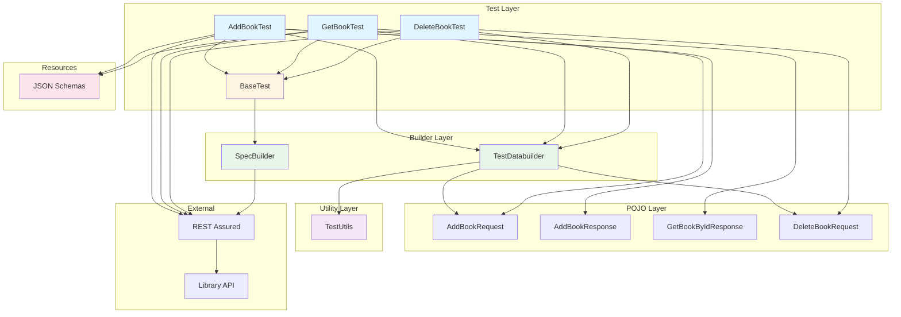
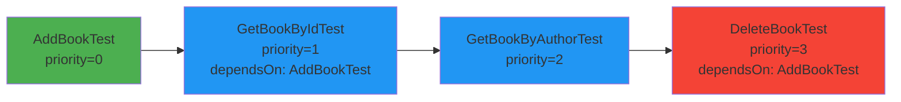
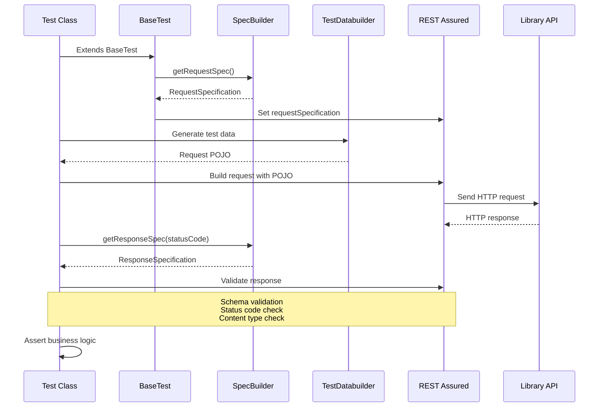

# REST Assured API Testing Framework

A comprehensive, maintainable API testing framework built with REST Assured, TestNG, and Maven for testing Library Management API endpoints.

## 📋 Table of Contents

- [Overview](#overview)
- [Framework Architecture](#framework-architecture)
- [Project Structure](#project-structure)
- [Key Components](#key-components)
- [Prerequisites](#prerequisites)
- [Running Tests](#running-tests)
- [Dependencies](#dependencies)
- [Test Execution Flow](#test-execution-flow)
- [Best Practices](#best-practices)

## 🎯 Overview

This framework provides a robust solution for API testing with the following features:

- **REST Assured Integration**: Powerful API testing with fluent assertions
- **POJO-based Request/Response Handling**: Type-safe data models
- **JSON Schema Validation**: Automatic response structure validation
- **Reusable Specifications**: Centralized request/response specifications
- **Test Data Builders**: Dynamic test data generation
- **TestNG Integration**: Advanced test execution and reporting
- **Maven Build System**: Dependency management and test execution

### API Endpoints Tested

- **Add Book**: `POST /Library/Addbook.php`
- **Get Book by ID**: `GET /Library/GetBook.php?ID={bookId}`
- **Get Book by Author**: `GET /Library/GetBook.php?AuthorName={authorName}`
- **Delete Book**: `POST /Library/DeleteBook.php`

## 🏗️ Framework Architecture

The framework follows a layered architecture pattern for better maintainability and reusability.



### Architecture Layers

1. **Test Layer**: Contains all test classes that extend `BaseTest`
2. **Builder Layer**: Provides test data builders and request/response specifications
3. **POJO Layer**: Java objects representing API request/response models
4. **Utility Layer**: Helper methods for test data generation
5. **Resources**: JSON schema files for response validation

## 📁 Project Structure

```
RestAssuredSampleFramework/
├── src/
│   ├── main/
│   │   ├── java/
│   │   │   └── org/umangqa/library/
│   │   │       ├── builders/
│   │   │       │   └── TestDatabuilder.java      # Test data generation
│   │   │       ├── pojo/
│   │   │       │   ├── addbook/                  # Add book request/response POJOs
│   │   │       │   ├── deletebook/               # Delete book request/response POJOs
│   │   │       │   └── getbook/                  # Get book response POJOs
│   │   │       ├── specs/
│   │   │       │   └── SpecBuilder.java          # Request/Response specifications
│   │   │       └── utils/
│   │   │           └── TestUtils.java            # Utility methods
│   │   └── resources/
│   │       └── schemas/                           # JSON schema validation files
│   │           ├── addBookResponse.json
│   │           └── getBookByIdResponse.json
│   └── test/
│       └── java/
│           └── org/umangqa/library/tests/
│               ├── BaseTest.java                  # Base test class with setup
│               ├── AddBookTest.java               # Add book test cases
│               ├── GetBookTest.java               # Get book test cases
│               └── DeleteBookTest.java            # Delete book test cases
├── testng.xml                                     # TestNG suite configuration
├── pom.xml                                        # Maven dependencies and configuration
└── README.md                                      # This file
```

## 🔧 Key Components

### 1. BaseTest

Base class for all test classes that sets up common configuration:

```java
public abstract class BaseTest {
    @BeforeClass
    public void setup() {
        RestAssured.requestSpecification = SpecBuilder.getRequestSpec();
    }
}
```

**Purpose**: Initializes REST Assured with default request specifications before test execution.

### 2. SpecBuilder

Centralized builder for request and response specifications:

- **Request Specification**: Sets base URI, content type, and headers
- **Response Specification**: Validates status code and content type

**Features**:
- Configurable base URL via system property (`baseUrl`)
- Default base URL: `http://216.10.245.166`
- Reusable across all tests

### 3. TestDatabuilder

Factory class for creating test data objects:

- `addBookRequestRandomPayload()`: Generates random test data
- `addBookRequestPayload()`: Creates payload with specific values
- `deleteBookRequestPayload()`: Creates delete request payload

### 4. TestUtils

Utility methods for test data generation:

- `generateRandomString()`: Generates random alphanumeric strings
- `generateRandomNumberString()`: Generates random numeric strings

### 5. POJO Classes

Type-safe Java objects for API requests and responses:

- Request POJOs: `AddBookRequest`, `DeleteBookRequest`
- Response POJOs: `AddBookResponse`, `GetBookByIdResponse`, `GetBookByAuthorResponse`

### 6. JSON Schema Validation

JSON schema files in `src/main/resources/schemas/` validate response structure:

- Ensures response matches expected schema
- Catches API contract violations early
- Provides clear error messages

## 📦 Prerequisites

Before running the tests, ensure you have the following installed:

- **Java**: JDK 22 or higher
- **Maven**: 3.6.0 or higher
- **IDE**: IntelliJ IDEA, Eclipse, or VS Code (optional)

### Verify Installation

```bash
# Check Java version
java -version

# Check Maven version
mvn -version
```

## 🚀 Running Tests

### Option 1: Using Maven

#### Run All Tests

```bash
mvn clean test
```

#### Run Specific Test Class

```bash
mvn test -Dtest=AddBookTest
```

#### Run Tests with Custom Base URL

```bash
mvn test -DbaseUrl=http://your-api-url.com
```

#### Run Tests and Generate Report

```bash
mvn clean test
# Reports are generated in: target/surefire-reports/
```

### Option 2: Using TestNG XML

#### Run Test Suite via Maven

```bash
mvn clean test -DsuiteXmlFile=testng.xml
```

#### Run TestNG XML from IDE

1. Right-click on `testng.xml` in your IDE
2. Select "Run" or "Run As TestNG Suite"

#### TestNG XML Configuration

The `testng.xml` file defines the test suite:

```xml
<suite name="Library API Suite">
    <test name="API Tests">
        <classes>
            <class name="org.umangqa.library.tests.AddBookTest"/>
            <class name="org.umangqa.library.tests.GetBookTest"/>
            <class name="org.umangqa.library.tests.DeleteBookTest"/>
        </classes>
    </test>
</suite>
```

### Option 3: Running Individual Tests from IDE

1. Open the test class in your IDE
2. Right-click on the test method or class
3. Select "Run" or "Run As TestNG Test"

### Test Execution Order

Tests are executed in the following order based on TestNG annotations:



**Test Dependencies**:
- `GetBookByIdTest` and `DeleteBookTest` depend on `AddBookTest` to create a book first
- `GetBookByAuthorTest` runs independently

## 📊 Test Execution Flow



## 📚 Dependencies

The framework uses the following key dependencies (defined in `pom.xml`):

| Dependency | Version | Purpose |
|------------|---------|---------|
| `rest-assured` | 5.5.1 | API testing framework |
| `testng` | 7.11.0 | Test execution framework |
| `jackson-databind` | 2.20.0 | JSON serialization/deserialization |
| `json-schema-validator` | 5.5.6 | JSON schema validation |
| `json-path` | 5.5.6 | JSON path extraction |
| `hamcrest` | 3.0 | Matcher library |
| `log4j-core` | 2.25.1 | Logging |
| `slf4j-simple` | 2.0.9 | Logging facade |

## 💡 Best Practices

### 1. Test Organization

- All test classes extend `BaseTest` for common setup
- Use descriptive test method names
- Group related tests in the same class

### 2. Test Data Management

- Use `TestDatabuilder` for creating test data
- Generate random data to avoid conflicts
- Reuse created resources (e.g., book ID) across tests

### 3. Assertions

- Use TestNG assertions for business logic validation
- Leverage JSON schema validation for response structure
- Validate both positive and negative scenarios

### 4. Request/Response Specifications

- Use `SpecBuilder` for reusable specifications
- Centralize base URL configuration
- Set common headers and content types

### 5. Test Dependencies

- Use TestNG `dependsOnMethods` for test ordering
- Share data between tests using static variables
- Clean up test data after execution

### 6. Logging

- Use `.log().all()` for request/response logging during development
- Remove or conditionally enable logging in production runs

## 📝 Example Test

Here's an example of how a test is structured:

```java
@Test(priority = 0)
public void addBookTest() {
    // 1. Generate test data
    AddBookRequest payload = TestDatabuilder.addBookRequestRandomPayload();
    
    // 2. Send request and validate response
    AddBookResponse res = given().log().all()
            .body(payload)
            .when()
            .post("/Library/Addbook.php")
            .then().log().all()
            .spec(SpecBuilder.getResponseSpec(200))
            .body(matchesJsonSchemaInClasspath("schemas/addBookResponse.json"))
            .extract().body().as(AddBookResponse.class);
    
    // 3. Assert business logic
    Assert.assertEquals(res.getMsg(), "successfully added");
    
    // 4. Save data for dependent tests
    createdBookId = res.getID();
}
```

## 🔍 Viewing Test Reports

After test execution, reports are generated in:

- **Surefire Reports**: `target/surefire-reports/index.html`
- **TestNG Reports**: `target/surefire-reports/testng-reports.html`

Open these HTML files in a browser to view detailed test results.

## 🛠️ Troubleshooting

### Common Issues

1. **Tests fail with connection error**
   - Verify the API is accessible
   - Check base URL in `SpecBuilder` or system property

2. **JSON schema validation fails**
   - Ensure schema files are in `src/main/resources/schemas/`
   - Verify schema matches actual API response

3. **Test dependencies fail**
   - Ensure dependent tests run in correct order
   - Check that shared data (e.g., `createdBookId`) is set

4. **Maven build fails**
   - Run `mvn clean install` to refresh dependencies
   - Verify Java version matches `pom.xml` configuration (JDK 22)

## 📄 License

This is a sample testing framework for educational purposes.

## 👤 Author

**Umang Bhatia**

---

**Happy Testing! 🚀**

